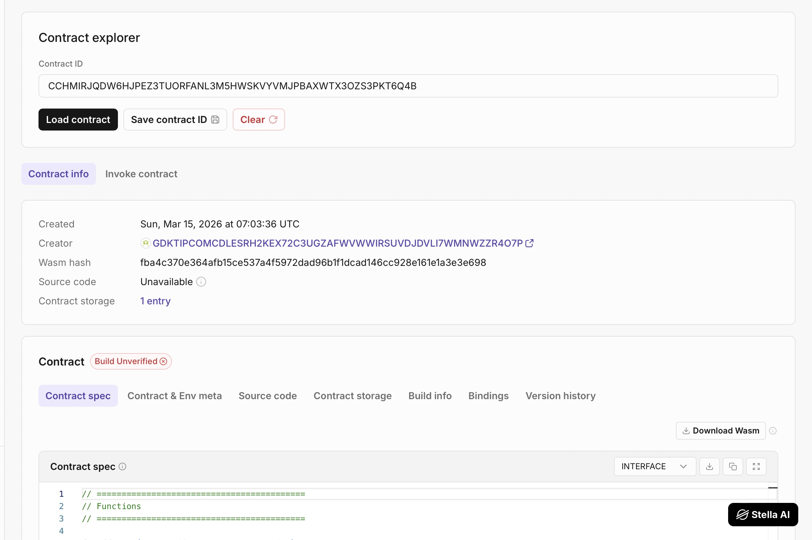
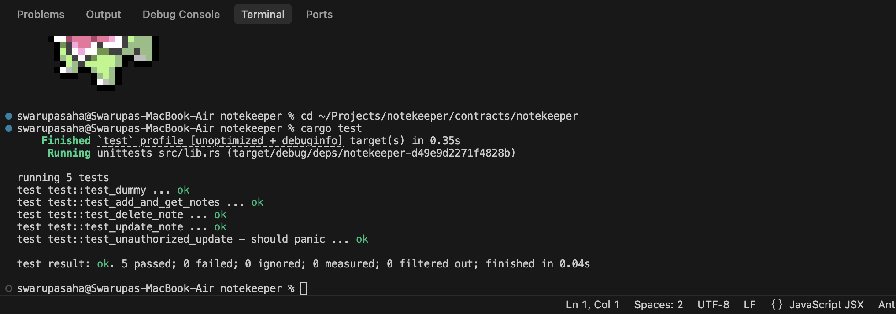

# 📝 NoteKeeper — Soroban Smart Contract

[](https://github.com/swarupasaha2005/stellar_notekeeper/actions/workflows/ci.yml)

## Project Description

**Live Demo:** [https://stellarnotekeeper.vercel.app/](https://stellarnotekeeper.vercel.app/)  
*(Video demo available at: [https://youtu.be/d-rnebXK6Vw?si=Ph7dAOWj4U60XxqH](https://youtu.be/d-rnebXK6Vw?si=Ph7dAOWj4U60XxqH))*

**NoteKeeper** is a decentralized note storage smart contract built using **Soroban on the Stellar blockchain**.
It has been upgraded to a **Production-Ready Advanced** version that includes:
- **Individual Note Storage**: More scalable than storing vectors of all notes.
- **Inter-Contract Calls**: An integrated Reward system where every valid note creation yields 1 MemoToken (MEMO) to the user.
- **Continuous Integration**: GitHub actions setup for automated rust linting and compiling.
- **Mobile Responsive Frontend**: Fully working retro-widget UI across all mobile devices.

### Smart Contract Addresses (Testnet)
- **MemoToken (MEMO) Contract**: `CCZJCZJ6L25Z3OH3SUDINGGEYR2S7LM64SQATIDUPWF7LFN56RNVSXHH`  
- **NoteKeeper Contract**: `CBDQAYMVYRQ2K3YUN5U7GXBRZ6C63BUDFM5O5O6HVWDRN26DL4XOZEAR`  
- **Example Transaction Hash (Inter-Contract Call)**: `288582925b15a65feb3176fa65ada4ea53fa48112ce3a34e3bda54665c30ab4b`

*(Run `stellar contract deploy` and invoke locally to update the actual addresses above if testing).*

---



### Mobile Responsive view


## What It Does


The **NoteKeeper** smart contract allows users to store short notes permanently on the blockchain.

Users can:

1. Add new notes
2. Store notes securely on-chain
3. Retrieve all stored notes from the contract
4. Update notes
5. Delete notes
6. Real-time clock

The contract uses Soroban’s instance storage to persist data across transactions.

---

## Features

### 🔐 User Authentication

Only authenticated wallet addresses can add notes using Soroban’s `require_auth()` security mechanism.

### 📝 On-Chain Note Storage

Notes are stored directly in the smart contract storage on the Stellar blockchain.

### 📦 Structured Data

Each note is stored using a structured data type containing:

* Owner address
* Note content

### ⚡ Lightweight & Efficient

The contract is minimal and optimized for Soroban's execution environment.

### 🧱 Rust + Soroban SDK

Built using Rust and the Soroban SDK for secure and efficient smart contract execution.

---

## Smart Contract Functions

### `add_note`

Adds a new note to the blockchain.

**Parameters**

* `user: Address` → Wallet address of the user creating the note
* `content: String` → The note text

**Behavior**

* Verifies the user's authorization
* Creates a new note
* Stores the note in contract storage

---

### `get_notes`

Returns all notes stored in the contract.

**Returns**

* `Vec<Note>` containing all stored notes

Each note contains:

```rust
pub struct Note {
    pub id: u64,
    pub owner: Address,
    pub content: String,
}
```

---

### `update_note`

Updates the content of an existing note. Only the owner of the note can update it.

**Parameters**

* `user: Address` → Wallet address of the user (must be the owner)
* `note_id: u64` → ID of the note to update
* `new_content: String` → The new note text

---

### `delete_note`

Deletes an existing note. Only the owner of the note can delete it.

**Parameters**

* `user: Address` → Wallet address of the user (must be the owner)
* `note_id: u64` → ID of the note to delete

---

## Running Tests

The project includes a comprehensive test suite in Rust. To run the tests, ensure you have Rust and the Soroban CLI installed, then run:

```bash
cd contracts/notekeeper
cargo test
```

The tests cover:
1. Adding and retrieving notes.
2. Updating existing notes.
3. Deleting notes.
4. Unauthorized access prevention.

## 📸 Demo Preview


## Project Structure

```
notekeeper/
│
├── src/
│   ├── lib.rs        # Soroban smart contract
│   └── test.rs       # Contract unit tests
│
├── Cargo.toml        # Rust dependencies
│
└── README.md         # Project documentation
```

---

## Tech Stack

* **Stellar Soroban**
* **Rust**
* **Soroban SDK**
* **WebAssembly (WASM)**

---

## Build the Contract

```
stellar contract build
```

---

## Deploy the Contract

```
stellar contract deploy \
--wasm target/wasm32-unknown-unknown/release/notekeeper.wasm \
--source <ACCOUNT_NAME> \
--network testnet
```

---

## Example Contract Invocation

Add a note:

```
stellar contract invoke \
--id <CONTRACT_ID> \
--source <ACCOUNT_NAME> \
--network testnet \
-- add_note \
--user <WALLET_ADDRESS> \
--content "Hello Soroban"
```

Retrieve notes:

```
stellar contract invoke \
--id <CONTRACT_ID> \
--source <ACCOUNT_NAME> \
--network testnet \
-- get_notes
```

---

## Deployed Smart Contract Link

```
https://lab.stellar.org/r/testnet/contract/CDB4KUPVJFG4NTSW6XUXKNK33BCYPOA7URO23R5U4PTP5XL5YH7MZDX2
```

Replace this with your deployed contract explorer link.

Example:

```
https://stellar.expert/explorer/testnet/contract/XXXXXXXXXXXXXXXX
```


---

## 🎨 UI Enhancements (Retro Web3 OS)

The frontend has been completely overhauled into an interactive, draggable **Retro OS Widget Desktop**:
* **Draggable Window Widgets**: Every UI component (Notes, Wallet, Player) is a movable window.
* **Animated Grid Background**: Floating pastel clouds and city trees scrolling in the background.
* **Pixel Cursor**: Custom layered SVG cursor matching the kawaii aesthetic.
* **Interactive Lofi Music Player**: Built-in Web Audio API synthesizer that plays smooth chords.
* **Dynamic Real-time Clock**: A `sys_clock.exe` widget that updates the time actively.
* **Day/Night Theme Toggle**: Native CSS variables mapping to a sun/moon switch for dark mode.
* **Global Retro Click Sounds**: Sonic feedback for every window interaction.

---

## Future Improvements

Possible enhancements for the smart contract:

* Add **timestamps**
* Support **user-specific note retrieval**
* Add **note tags/categories**

---

## License

MIT License
